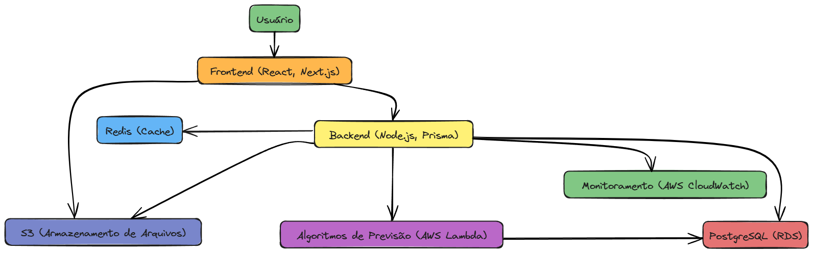

<p align="center">
    
</p>

# TÁ DE BOA, é só um README

O intuito desse projeto é criar um aplicativo que possa ser utilizado para promover maior proteção e tranquilidade para os cidadãos.

O desenvolvimento desse aplicativo foi feito na [Residência de Software](https://www.restic36.cepedi.org.br/) proposto pela [CEPEDI](https://www.cepedi.org.br/). O desafio em questão foi motivado pelos dados alarmantes sobre criminalidade em Feira de Santana, Bahia, destacada como uma das cidades mais violentas do País.

Os conceitos-chaves que nortearam o desenvolvimento do aplicativo incluem segurança pública, baseada em dados, prevenção colaborativa e o uso de tecnologias como ciência de dados, serviços em nuvem e desenvolvimento mobile.

## Arquitetura
<p align="center">
    
</p>

O **frontend**, desenvolvido com **React** e **Next.js**, oferece uma interface responsiva para capturar dados como denúncias e consultas, sendo hospedado no **AWS S3** com distribuição via **CloudFront** para otimizar a entrega de conteúdo.

No **backend**, construído com **Node.js** e **Prisma**, as requisições REST/GraphQL são processadas, conectando-se ao banco de dados **PostgreSQL** para armazenar informações transacionais e ao **Redis** para cache de dados frequentes. O backend é implantado em instâncias **EC2** configuradas com auto scaling para suportar aumentos de carga.

Os dados transacionais são armazenados em um banco **PostgreSQL** gerenciado pelo **Amazon RDS**, que garante backups automáticos e alta disponibilidade. Arquivos enviados pelos usuários, como fotos e vídeos, são armazenados no **Amazon S3**, enquanto **Redis** é utilizado para melhorar o desempenho e gerenciar sessões de usuários, quando necessário.

A funcionalidade de previsão de crimes é realizada por algoritmos de ciência de dados executados periodicamente em **Lambda Functions**, garantindo processamento eficiente e escalável. Logs de aplicação, métricas de desempenho e alertas críticos são monitorados pelo **AWS CloudWatch**, assegurando a saúde do sistema.

Com esse fluxo, o **frontend** interage diretamente com o **backend**, que consulta o banco de dados, cache ou processa dados preditivos para atender as solicitações, garantindo uma experiência otimizada e confiável para os usuários.

## Desenvolvimento

O desenvolvimento do "Tá de Boa" começou com a definição de funcionalidades e requisitos do aplicativo. A cidade de Feira de Santana foi escolhida como foco do projeto, e a partir disso, permitindo o uso de Algortimos de ciência de dados para prever locais de maior risco de criminalidade. 

Além disso, a aplicação será capaz de receber denúncias de crimes e acidentes. Os registros incluirão detalhes como localização, tipo de crime, detalhes sobre o ocorrido, uso de armas de fogo, entre outros.

## Tecnologias

O aplicativo foi desenvolvido utilizando as seguintes tecnologias:

<ul>
    <li>
        <a href="https://reactjs.org/">React</a> 
         + 
        <a href="https://nextjs.org/">Next.js</a>
        
    </li>
    <li>
        <a href="https://www.postgresql.org/">PostgreSQL</a>
        
    </li>
    <li>
        <a href="https://www.prisma.io/">Prisma</a>
        
    </li>
    <li>
        <a href="https://nodejs.org/en/">Node.js</a>
        
    </li>
</ul>

## Instalação

Para instalar o aplicativo, siga os passos abaixo:

1. Clone o repositório:

```bash
git clone
```

2. Instale as dependências em ambas as pastas `server` e `web`:
```bash
cd server
npm install
cd ../web
npm install
```
obs: siga as instruções no README de cada subpasta.

3. Inicie o servidor:
```bash
cd server
npm run dev
```

4. Inicie o aplicativo:
```bash
cd web
npm run dev
```


